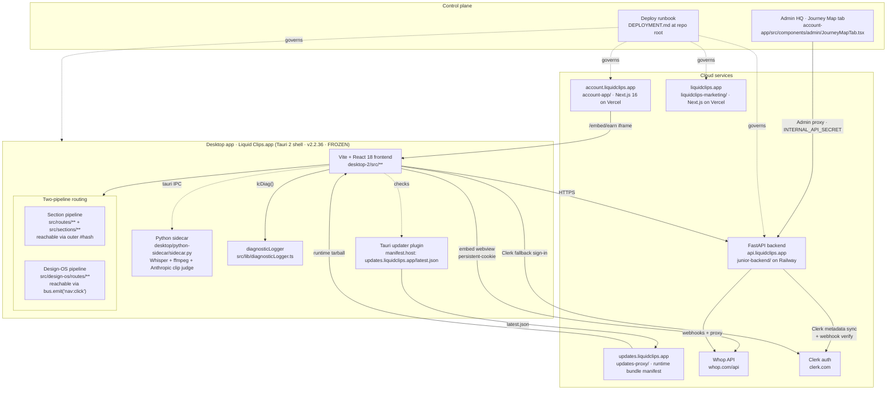

# Liquid Clips · Architecture Map

Handover doc for the Nigerian dev team. Read [`desktop-2/CLAUDE.md`](../CLAUDE.md) first — the two-pipeline pattern is load-bearing and any drift from it becomes a shell-guard failure at commit time.

Repo root: `/Users/dipdip/code/jnr` · Remote: `https://github.com/Powstit/liquidclips.git`

---

## System diagram

---

## Boundary map

**Runs local (inside the .app):**
- Vite/React UI · `desktop-2/src/**`
- Tauri 2 native shell · `desktop-2/src-tauri/`
- Python sidecar (spawned via Tauri) · `desktop/python-sidecar/sidecar.py` — Whisper transcription, Anthropic clip judgment, ffmpeg cut/reframe/thumbnail
- Persistent-cookie in-app Whop webview (walk-around for publishing/schedule — see [`liquidclips_publish_walkaround.md`](../../.claude/skills/liquidclips_publish_walkaround.md) memory)
- Keychain (JWT + tier cache)

**Runs remote:**
- FastAPI on Railway — auth, tier resolution, license JWT issuance, webhooks (Clerk/Whop/Stripe), Ayrshare proxy (retired but still wired), `/proxy/anthropic/clip-bundle` hosted clip judge
- Next.js account-app on Vercel — dashboard + `/embed/earn` iframe consumed by the desktop's Tauri child webview
- Next.js marketing on Vercel — `/download` route surfaces latest GitHub Release asset
- Updates proxy on Railway (`updates-proxy/`) — serves `/latest.json` for Tauri auto-update AND `/runtime/manifest.json` for the runtime hot-swap channel

**Whop-owned (never mirror):**
- Subscription state · view counts · payouts · community rooms
- Backend caches only `whop_user_id`, `paid_until`, `subscription_status` per [`junior-backend/CLAUDE.md`](../../junior-backend/CLAUDE.md) architecture rules. Everything else is fetched via `/whop/*` proxy at request time.

**Liquid Clips-owned:**
- Clip metadata + local project state (in-app SQLite via sidecar)
- Bonus ledger, sponsored campaigns, community channel bindings (backend Postgres on Railway)
- Iron-gate sentinels, brand tokens, mockup gallery

**Must never change without approval:**
- **Shell FROZEN** — no `Rust / Cargo / tauri.conf / sidecar / package.json / new native commands / shell rebuild` without an explicit greenlight ([`desktop-2/CLAUDE.md`](../CLAUDE.md) header).
- **Iron gate sentinels** (`IRON GATE IG-NNN`) — pre-commit hook blocks deletion. Registry lives at `desktop/docs/IRON_GATES.md`.
- **Brand-token parity** — `scripts/brand-kit-drift-check.sh` compares `src/brand/brandTheme.css` against `../liquidclips-marketing/src/app/globals.css`. Hex drift blocks commit under IG-012.
- **Money-surface rule** (LOCKED 2026-07-10) — see below.

---

## Two-pipeline pattern (LOCKED 2026-07-10)

Every user-facing surface resolves through exactly one pipeline. Mixing them is a shell-guard failure.

1. **Section pipeline** — money surfaces + cross-cutting shells (Wallet, Cold entry, Outreach, Cancellation, Catalog, Account, Diagnostics, HQ Bridge, Learn).
   - Owned by `src/routes/**` + `src/sections/**`.
   - Registered in `src/shell/sectionRegistry.ts`.
   - Reachable via the outer hash (`#/account`, `#/outreach`, `#/browse`).
2. **Design-OS pipeline** — tool surfaces + Kade-driven ergonomic routes (Home cockpit, Workstation, Campaigns, Analytics, Channels, Settings, Support, Submissions, Thumbnail Studio, Login onboarding).
   - Owned by `src/design-os/routes/**`.
   - Registered in `src/design-os/routing/SimulatorRouter.tsx` (`SURFACE_FOR` + `ALIAS_FOR` — see [`SimulatorRouter.tsx:196`](../src/design-os/routing/SimulatorRouter.tsx)).
   - Reachable via `bus.emit("nav:click", …)` from `ConsoleNav`.

The event bus contract lives in [`src/design-os/bridge/events.ts`](../src/design-os/bridge/events.ts). `bus.emit(...)` and `useEvent(...)` re-export through [`src/design-os/bridge/index.ts`](../src/design-os/bridge/index.ts).

## Money-surface rule (LOCKED 2026-07-10)

Money surfaces (wallet, cold-entry, outreach, cancellation, catalog) MUST have:

1. An approved HTML mockup in `desktop-2/docs/mockups/approved/*.html`
2. A matching founder video in `public/brand/founder/*.mp4`
3. 3+ explicit states in the built React route (loading, empty, error at minimum; money surfaces additionally require the cinematic scrubber states declared in the approved HTML)

Tool surfaces (workstation, editor, community, channels, schedule, settings, analytics) DO NOT require this.

Ship-lens enforces the rule per pipeline. Scaffold new money surfaces via the `new-money-surface` skill so all three artefacts land together.

### Fallback resilience (scoped to Wallet only)

`SectionWithFallback` wraps only `WalletDetail` (`sections/account/AccountSection.tsx`) because the Design-OS `EarnRoute` is the only genuine legacy fallback. Other Section-pipeline surfaces still get `EngineErrorBoundary` but no lower-tier surface to swap in. **Do not claim app-wide fallback resilience.**

---

## State

- **Zustand stores** — `src/design-os/state/**` (per-domain: `useCampaigns.ts`, `useCommunity.ts`, `useEarnSummary.ts`, `useChannels.ts`, `useEngineSession.ts`, `useMe.ts`, `useRewardClips.ts`, `useSchedule.ts`, `useTierCaps.ts`, `useWhopReward.ts`).
- **Hook layer** — `src/lib/**` — thin wrappers over sidecar IPC + backend fetch. Notable: `authedFetch.ts`, `authStorage.ts`, `bridgeToBackend.ts`, `updateJourney.ts`, `wallet.claim.test.ts`, `updater.ts`, `useAuth.ts`.
- **No fixture data** — real hooks only. Render honest empty states when the API returns nothing.

## Bus

- Contract: [`src/design-os/bridge/events.ts`](../src/design-os/bridge/events.ts) — typed `RouteId` + `KadeState` unions.
- Emit: `bus.emit("nav:click", { route })`, `bus.emit("settings:open-tab", { tab })`, `bus.emit("home:open-panel", { tab })`.
- Consume: `useEvent(...)` hook (`src/design-os/bridge/useEvent.ts`).
- Rule: Kade never emits its own state events; user actions do.

## Telemetry

- Client logger: [`src/lib/diagnosticLogger.ts`](../src/lib/diagnosticLogger.ts).
- `lcDiag(topic, data)` writes to console (prefix `[LC-DIAG]`) AND batches to `POST /telemetry/diagnostic` on the backend. Railway logs pick each event up as `[LC-CLIENT-DIAG]`.
- **Behavioural only.** No `*_rendered` events. `EngineErrorBoundary` + Watchdog wrap every reachable route and route their own signals through `lcDiag`.

---

## Testing architecture

- **Playwright E2E** — `desktop-2/tests/e2e/*.spec.ts` (56 spec files). Drives the Vite dev server at port 1420 (or `PW_PORT` override). Config: [`playwright.config.ts`](../playwright.config.ts).
- **Vitest unit** — colocated `src/**/*.test.ts` + `src/**/*.test.tsx`. Config: [`vitest.config.ts`](../vitest.config.ts).
- **Shell guard** — [`scripts/assert-shell-contracts.sh`](../scripts/assert-shell-contracts.sh). Asserts identity (`liquid-clips-shell`, `app.liquidclips.desktop`, product name), version alignment across `package.json` / `tauri.conf.json` / `Cargo.toml`, presence of every launch route, Kade poses, brand assets, browser-overlay wire, auth safety, paywall/agency honesty strings, publish/schedule honesty strings, sidecar bundling, updater plugin, and drift-forbidden legacy brand strings.
- **Invariant sweep** — `npm run test:invariant` chains tsc + shell guard + brand-kit drift + agency-preview paywall gate + `verify-app`.

## CI / deployment

Read [`DEPLOYMENT.md`](../../DEPLOYMENT.md) at repo root — it is the single source of truth. Summary:

| Surface | Auto-deploys on push? | Deploy command | Prod URL |
|---|---|---|---|
| `account-app` | No | `vercel deploy --prod --yes --token $VERCEL_TOKEN` from `account-app/` | https://account.liquidclips.app |
| `liquidclips-marketing` | No | Same, from `liquidclips-marketing/` | https://liquidclips.app |
| `junior-backend` | No (GH source disconnected on Railway) | `railway up --service junior-backend --detach` from `junior-backend/` | https://api.liquidclips.app |
| Desktop | No (tag-triggered) | `bash desktop/scripts/ship.sh <version> "notes"` | GitHub Releases on tag push |

`ship.sh` enforces clean tree, on `main`, unshipped version, signs + notarises + staples the DMG, uploads a draft Release, and verifies the live manifest before claiming success. Never bypass it.

## Runtime update flow

Two distinct update paths:

1. **Full binary update** (Tauri auto-updater) — `src-tauri/tauri.conf.json` points the updater endpoint at `https://updates.liquidclips.app/latest.json`. Signed with `.junior-updater/junior-updater.key`. Ships the whole .app.
2. **Runtime frontend hot-swap** ([`scripts/runtime-ship.sh`](../scripts/runtime-ship.sh)) — vite builds `dist/`, tars → `liquidclips-runtime-<version>.tar.gz`, minisign-signs with the same updater key, POSTs to `/runtime/upload` (verdict `PENDING`), ship-lens-reviewer runs, then `/runtime/promote` flips verdict to `PASS` so `/runtime/manifest.json` serves the bundle to active users on next relaunch. Prior bundles live in [`dist-runtime-pack/`](../dist-runtime-pack/).

BUG-006/007/009/012 constraints tracked in [`docs/BUGS_ERRORS_FIXES.md`](./BUGS_ERRORS_FIXES.md) — read that before altering the runtime channel; regressions there strand active users on a broken bundle.

## Iron gates

`IRON GATE IG-NNN` sentinel comments mark load-bearing invariants:

- Pre-commit hook greps for the sentinel and refuses commits that delete one without the documented override.
- Registry: `desktop/docs/IRON_GATES.md`.
- Examples:
  - IG-003 — intro splash contract (`src/overlays/IntroSplash.tsx`).
  - IG-012 — brand-token parity between `src/brand/brandTheme.css` and `../liquidclips-marketing/src/app/globals.css`, enforced by [`scripts/brand-kit-drift-check.sh`](../scripts/brand-kit-drift-check.sh).
  - IG-015 — keychain passive-read guard ([`scripts/iron-gates/bug-015.sh`](../scripts/iron-gates/bug-015.sh)).
  - IG-LC2-017 / IG-LC2-018 — clip preview overlay reads ([`src/design-os/studio/ClipPreviewShell.tsx`](../src/design-os/studio/ClipPreviewShell.tsx)).
  - IG-SOV-2.2-001 — carrot economics (5% LC fee · $10 min withdraw · $50 …) ([`src/lib/carrot.ts`](../src/lib/carrot.ts)).

Additionally, `iron-gate-lens` skill runs on every edit — greps target files for adjacent sentinels before you touch them.

## HQ Admin (control plane)

- Component: [`account-app/src/components/admin/JourneyMapTab.tsx`](../../account-app/src/components/admin/JourneyMapTab.tsx) — primary state-of-truth for the 80 wired customer journeys.
- Siblings: `AdminHQ.tsx`, `MoneyFunnelTab.tsx`, `ClipRunsTab.tsx`, `ColdLeadsTab.tsx`, `ConstellationTab.tsx`, `SignInOpsTab.tsx`, `SurfacesTab.tsx`, `StatePuppeteerTab.tsx`, `SystemMapTab.tsx`, `LcosEventsTab.tsx`, `LaunchWarRoomTab.tsx`, `CanaryTab.tsx`, `BetaCohortTab.tsx`, `PromoCodesTab.tsx`, `CarouselClipsTab.tsx`, `HQCommandTabs.tsx`.
- Wire: HQ proxies to backend admin endpoints (`/admin/community/channels`, `/admin/banners`, `/admin/announcements`, `/admin/bonus-ledger`) via `INTERNAL_API_SECRET`.
- Rule: any wire change updates the tab, this file, and `ship-lens-review.json` in the same turn.

---

## Verification checklist

Files inspected while drafting:

- `/Users/dipdip/code/jnr/CLAUDE.md`
- `/Users/dipdip/code/jnr/DEPLOYMENT.md`
- `/Users/dipdip/code/jnr/desktop-2/CLAUDE.md`
- `/Users/dipdip/code/jnr/desktop-2/package.json`
- `/Users/dipdip/code/jnr/desktop-2/vite.config.ts`
- `/Users/dipdip/code/jnr/desktop-2/playwright.config.ts`
- `/Users/dipdip/code/jnr/desktop-2/scripts/assert-shell-contracts.sh`
- `/Users/dipdip/code/jnr/desktop-2/scripts/brand-kit-drift-check.sh`
- `/Users/dipdip/code/jnr/desktop-2/scripts/runtime-ship.sh`
- `/Users/dipdip/code/jnr/desktop-2/src/design-os/routing/SimulatorRouter.tsx`
- `/Users/dipdip/code/jnr/desktop-2/src/design-os/bridge/events.ts`
- `/Users/dipdip/code/jnr/desktop-2/src/design-os/bridge/index.ts`
- `/Users/dipdip/code/jnr/desktop-2/src/lib/diagnosticLogger.ts`
- `/Users/dipdip/code/jnr/desktop-2/src-tauri/tauri.conf.json` (grep only)
- `/Users/dipdip/code/jnr/desktop-2/src/design-os/state/` (directory)
- `/Users/dipdip/code/jnr/desktop-2/src/design-os/routes/` (directory)
- `/Users/dipdip/code/jnr/desktop-2/src/routes/` + `src/sections/` (directories)
- `/Users/dipdip/code/jnr/desktop-2/tests/e2e/` (directory)
- `/Users/dipdip/code/jnr/junior-backend/CLAUDE.md`
- `/Users/dipdip/code/jnr/junior-backend/app/config.py`
- `/Users/dipdip/code/jnr/junior-backend/requirements.txt`
- `/Users/dipdip/code/jnr/account-app/src/components/admin/JourneyMapTab.tsx` (path confirmed)
- `/Users/dipdip/code/jnr/desktop/python-sidecar/sidecar.py` (grep only)
- `/Users/dipdip/code/jnr/updates-proxy/index.html` (grep only)
