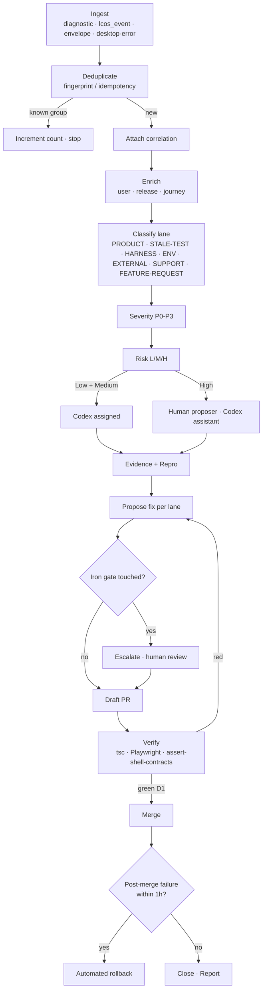

# HQ + Codex Operating Model

Owner: Liquid Clips core • Audience: Nigerian dev team + Codex triage agents
Status: RC1 handover • Last citation sweep 2026-07-13

HQ is the Liquid Clips **control plane**. It is not a monitoring dashboard —
it is where incoming events, failures, support requests and feature asks
get **classified, routed, and turned into work**. User machines run the
clip pipeline (compute); HQ decides what happens when that compute
misbehaves.

Codex is the AI-agent tier that does first-pass triage on everything
arriving at HQ.

---

## 1. The 15-step HQ triage flow

Every event that lands in HQ — from a `lcDiag` heartbeat
(`desktop-2/src/lib/diagnosticLogger.ts`) to a fingerprinted crash group
(`junior-backend/app/routes/telemetry_ingest.py`, `DesktopErrorGroup`)
to a hand-typed support ticket in the Admin HQ inbox
(`account-app/src/components/admin/AdminHQ.tsx` tab list, line 180) —
walks the same 15 steps.

```
INGEST  → CLASSIFY → EVIDENCE → ROUTE → ACT → PROVE → CLOSE
```

Expanded:

1. **Ingest.** Event lands via one of the four canonical wires
   (`POST /telemetry/diagnostic`, `POST /lcos/events/ingest`,
   `POST /telemetry/event`, `POST /telemetry/desktop-error` — all in
   `junior-backend/app/routes/telemetry.py` +
   `junior-backend/app/routes/telemetry_ingest.py` +
   `junior-backend/app/routes/lcos_events.py`). HQ surfaces it in
   Bugs / LCOS Events / Alerts / Inbox depending on shape.
2. **Deduplicate.** Fingerprint against the `DesktopErrorGroup` table
   (`_compute_fingerprint`, telemetry_ingest.py:220) or `lcos_event`
   idempotency tuple `(topic, ts_ms, payload_hash)` (lcos_events.py:102).
   If it's a known group, increment count and stop at step 4.
3. **Attach correlation.** Envelope-shape events already carry
   `correlation_id / session_id / attempt_id`
   (`desktop-2/src/lib/telemetry/envelope.ts:65`). For legacy
   `lcDiag` events, fall back to `x-lc-diag-session` header.
4. **Enrich.** Look up the user (or anon session), current release
   / build, entitlement class, onboarding state, active journey.
5. **Classify by owning lane** (see §2 — six lanes).
6. **Assign severity** — P0 / P1 / P2 / P3, using the rules in §3.
7. **Assign risk level** — Low / Medium / High (see §3).
8. **Pick agent** — Codex first for Low + Medium under the LOC budget
   in `CODEX_GUARDRAILS.md`; escalate to human otherwise (see §5).
9. **Evidence gather.** Codex pulls the surrounding `lcos_event`
   window (60s before + 30s after ts_ms), the release SHA, and the
   affected surface's mockup + citation from `JourneyMapTab.tsx`
   (`account-app/src/components/admin/JourneyMapTab.tsx`).
10. **Reproduce.** Codex runs `npm run dev` / `npx playwright test`
    for the affected route (see allowlist in `CODEX_GUARDRAILS.md`).
    Repro or explicit "cannot repro" is required — no diagnosis is
    accepted without one.
11. **Propose fix.** A patch, a test update, an env change, or a
    partner-escalation memo — whichever the classification lane
    prescribes. Never freehand.
12. **Guard.** Iron-gate scan (any `IRON GATE IG-NNN` sentinel — grep
    across `desktop-2/src/**` shows currently active gates
    `IG-003`, `IG-SOV-2.2-001`, `IG-LC2-015..018`). If the diff
    touches a gate, escalate to human review — no exceptions.
13. **PR.** Follow the format in `CODEX_GUARDRAILS.md` (title +
    diff summary + verification + regression proof).
14. **Verify.** Green D1 = TypeScript build (`npx tsc -b`),
    Playwright pass on the affected route, and
    `bash scripts/assert-shell-contracts.sh`
    (`desktop-2/scripts/assert-shell-contracts.sh`). PR that green
    all three is mergeable by the lane's designated reviewer.
15. **Close + report.** Merge, mark the incident closed with a link
    to the merge SHA. Post-merge failure inside 1 hour triggers the
    automated rollback described in `CODEX_GUARDRAILS.md`.

Mermaid representation of the flow:



---

## 2. Specialist lanes

Every incident is one of six lanes. Codex must pick exactly one before
moving past step 5. The lane decides which allowlisted commands run,
which paths may be edited, and who reviews.

| Lane | What it looks like | Allowed edit paths | Reviewer | Ships as |
| --- | --- | --- | --- | --- |
| **PRODUCT** | A real bug in shipped behaviour — `envelope.failure` non-null, `stable_error_code` set, reproduces on `npm run dev` (`desktop-2/package.json` scripts). | `desktop-2/src/**` (frontend) or `junior-backend/app/**` (backend) — never both in one PR. | Human (Daniel or lane owner). | Standard PR + green D1 + regression proof. |
| **STALE-TEST** | Playwright / vitest fails, but manual walk shows the product behaves correctly and the intent has changed since the test was written. | `desktop-2/tests/**` and `desktop-2/src/**/*.test.ts(x)` only. | Codex self-review inside LOC limits. | Fast update-and-verify PR — no product code touched. |
| **HARNESS** | Failure inside `tests/e2e/_auth-harness.ts`, Playwright config drift, `__LCOS_E2E__` gate handling (`desktop-2/src/lib/diagnosticLogger.ts:62`). | `desktop-2/tests/**` + `desktop-2/playwright.config.ts` (limited to test infra). | Codex self-review with mandatory diff summary. | Test-file-only PR. |
| **ENV** | Disk full, sidecar exhausted (`sidecar_probe` classifier `restart_cap`, `desktop-2/src/lib/diagnosticLogger.ts:247`), Railway memory pressure, timing under load. | No app-code edits. Infra runbook only. | On-call (see §5). | Ops action, not a PR. Codex writes the runbook entry. |
| **EXTERNAL** | Whop 401 on `whop_payments_proxy`, Clerk 401 on `auth_clerk_exchange`, Ayrshare API drift, Stripe webhook signature mismatch. | No app-code edits until the partner side is stabilised. | Human — partner-escalation memo drafted by Codex. | Partner ticket + a memo file in `desktop-2/docs/`. |
| **SUPPORT** | User needs help. No code fix. Usually a wrong assumption about pricing / entitlement / where the button lives. | `desktop-2/docs/**` (for docs updates) + reply drafts. | Human. | Written reply + doc PR if the confusion is recurring. |
| **FEATURE-REQUEST** | User asks for a new capability. Not a bug. | No code changes. Add to the backlog file (currently a TODO — see gap in §6). | Daniel — product intent lives with him. | Backlog entry + acknowledgement reply. |

A single event can spawn multiple lane workstreams (a crash and a
harness gap and a support reply). Codex splits them into separate PRs
so each lane's reviewer only sees the paths they own.

---

## 3. Risk levels

Severity answers *how bad is it*. Risk answers *how much autonomy Codex
gets to fix it*.

**Low risk** — Codex may open a PR and self-approve within the LOC limit
in `CODEX_GUARDRAILS.md`.

- Comment / dead-code / typo fixes.
- Test-name changes.
- Doc updates inside `desktop-2/docs/**` that don't change guidance
  (only formatting or citation drift).
- No money-surface path touched (see below).

**Medium risk** — Codex opens a PR, a human reviewer approves.

- Test updates (STALE-TEST or HARNESS lanes).
- New telemetry topics added to the diagnostic logger — new topic
  string, no behaviour change.
- Bug fix confined to one file under `desktop-2/src/**`, ≤200 LOC,
  no schema change.

**High risk** — Codex proposes, human approves + human tests + human
ships.

- **Money surfaces** — any file under
  `desktop-2/src/routes/wallet-detail/**`,
  `desktop-2/src/routes/**` money-surface routes named in
  `desktop-2/CLAUDE.md` §"money-surface rule" (Wallet, Cold entry,
  Outreach, Cancellation, Catalog).
- **Auth surfaces** — `SimpleLoginPanel`, `ClerkOtpPanel`,
  `authedFetch.ts`, `desktop-2/src/lib/telemetry/sinks/desktopErrorSink.ts`.
- **Iron-gate-adjacent** edits (see step 12 in §1).
- Backend schema or migration changes
  (`junior-backend/alembic/versions/**` — currently unmanaged;
  live schema changes go through `app/main.py` lifespan per
  `junior-backend/CLAUDE.md`).
- Any change to
  `desktop-2/src-tauri/**`, `desktop-2/tauri.conf.json`,
  `desktop-2/package.json`, `.github/workflows/**`.

The blocklist above overlaps `CODEX_GUARDRAILS.md` — that file is
authoritative for Codex; this table is for humans deciding *when* to
delegate.

---

## 4. Scale + operational model

**Target: 40 000 paid users on Agency at $99.99/mo.**

Two hard architectural choices flow from this:

**a) HQ is the control plane.** Not a data warehouse, not a log
aggregator. It reads from `lcos_event`, `telemetry_events`,
`desktop_error_group`, and admin RPC endpoints exposed by
`junior-backend/app/routes/admin.py` (30+ endpoints registered under
`/admin/*` — see `router = APIRouter(prefix="/admin", tags=["admin"])`
at admin.py:67). Everything else — the LcosEventsTab query surface at
`account-app/src/components/admin/LcosEventsTab.tsx`, JourneyMap
citations, WarRoom rollups — is a projection of what those tables
already hold. HQ never becomes the source of truth for user data or
clip content.

**b) User machines are compute.** The Tauri shell owns
transcription, judgment, and cutting via the Python sidecar
(`desktop-2/CLAUDE.md` — sidecar is frozen). The backend never
receives clip binaries, transcripts, or captions. This is why the app
scales past 40k without a proportional backend budget: the expensive
work happens on the customer's Mac.

**Dynamic Codex cohorts.** Triage load is bursty (release windows
generate 10–100× the idle traffic). Codex agents are spun up per lane
when the `lcos_event` topic-rate crosses a threshold and torn down
during idle. Cohort size is set by the on-call human, not by Codex
itself — Codex cannot self-scale.

**Contrast with server-heavy SaaS.** A comparable SaaS at 40k users
would need clip storage, transcode GPUs, and hot-path servers per
region. Liquid Clips at 40k needs: one Railway backend (currently
`numReplicas: 1` — `junior-backend/CLAUDE.md`), one Vercel account
app, one Vercel marketing site, one Tauri release channel. The clip
pipeline scales at zero marginal cost because it runs on the user's
machine.

---

## 5. Escalation paths

Codex escalates the moment any of the following is true. Escalation is
never a failure — it is the correct next step.

- **To Daniel** — product intent conflicts (STALE-TEST that changes
  user-visible behaviour), pricing changes, security decisions,
  anything touching a money surface without an approved mockup at
  `desktop-2/docs/mockups/approved/*.html`, any iron-gate touch.
- **To Nigerian dev team** — normal feature and bug work in the
  Medium risk band. This is the default recipient for anything Codex
  can't finish inside its LOC + retry budgets.
- **To on-call (infra)** — ENV lane incidents, Railway degradation,
  DB latency, deploy pipeline failures.
- **To security team** — any hit on a `**/secrets/**` path, any
  token in a payload that survived server-side redaction
  (`_sanitize_dict` in `telemetry_ingest.py:60`), any suspected key
  rotation.

Codex does not escalate to itself. If a triage attempt exceeds three
retries on the same failing check (see `CODEX_GUARDRAILS.md`), the
event is moved to the human queue with the retry trail attached.

---

## 6. Gaps flagged

- **FEATURE-REQUEST backlog file** does not yet exist. Recommend
  `desktop-2/docs/FEATURE_REQUESTS.md` as the target with a stable
  header schema so Codex can append without a merge conflict.
- **Automated rollback** (step 15) is prescribed here and in
  `CODEX_GUARDRAILS.md` but I did not find an implementing script in
  `desktop-2/scripts/**` or `.github/workflows/**` (no read access
  from this vantage). Nigerian team should wire this or confirm it
  lives elsewhere before Codex is turned loose.
- **Dynamic Codex cohort scaling** — the threshold table needs a
  home. Suggest `desktop-2/docs/CODEX_COHORT_THRESHOLDS.md`.

---

## Verification checklist

- [ ] 15-step flow walks INGEST → CLASSIFY → EVIDENCE → ROUTE → ACT → PROVE → CLOSE with concrete file citations
- [ ] Six lanes enumerated with distinct allowed-path scopes
- [ ] Risk levels map to autonomy tiers and money-surface list matches `desktop-2/CLAUDE.md`
- [ ] Scale model states HQ = control plane and user machines = compute
- [ ] Escalation paths cover Daniel, Nigerian devs, on-call, security
- [ ] Mermaid flowchart renders in GitHub preview
- [ ] Every code claim carries a file path or file:line citation
