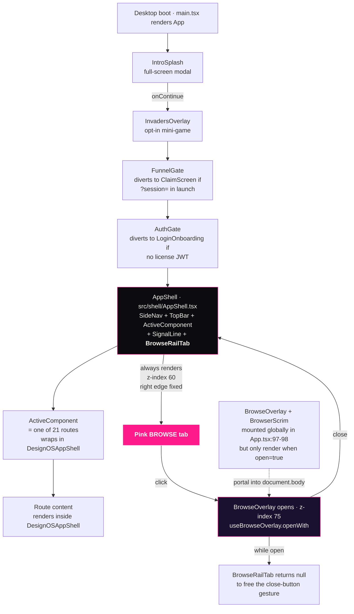
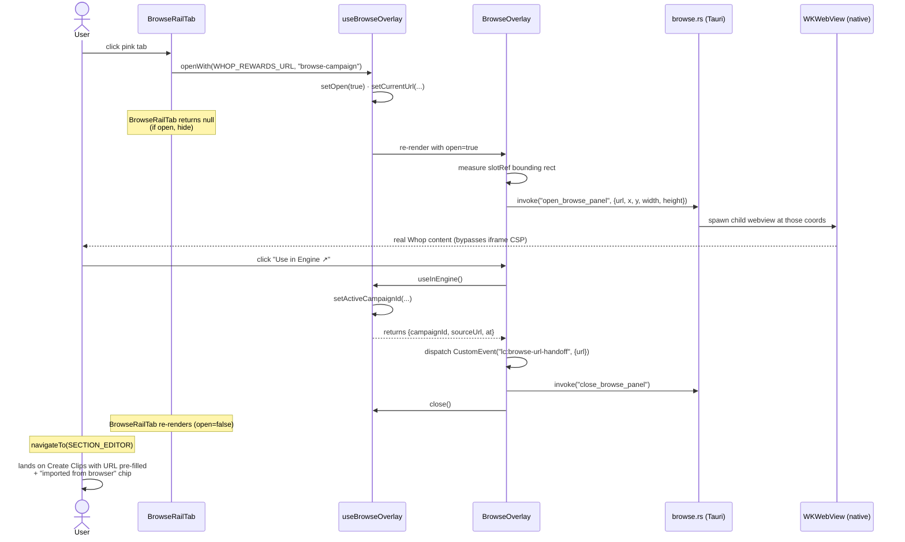

# Browse Tab Architecture · proof + per-route presence

**Locked 2026-06-25.** The persistent pink Browse tab is an application-level navigation primitive, mounted once in the top-level shell, present on every post-auth route, and visible across the entire workspace unless intentionally hidden by a full-focus modal.

This document is the architectural proof Daniel asked for. Companion to `BROWSE_TAB_ROUTE_PRESENCE.md` (the per-route audit) and `RUNTIME_UPDATE_ARCHITECTURE.md` (the future runtime-update model).

---

## 1 · Mount diagram



**Key invariants:**
- BrowseRailTab is mounted EXACTLY ONCE, in `src/shell/AppShell.tsx:124`, at the same render layer as SideNav/TopBar/ActiveComponent
- It renders OUTSIDE the route component slot, so a route can never hide it accidentally
- It uses `position: fixed; right: 0; top: 50%; z-index: 60` — anchored to the WINDOW viewport, not the route container
- The only conditional that hides it: `if (open) return null` (line 18 of `BrowseRailTab.tsx`) — to free the close gesture when the overlay is on

---

## 2 · Per-route presence proof

The audit query:
```bash
find desktop-2/src/design-os/routes -name "*.tsx" | wc -l   # → 21
grep -l "DesignOSAppShell" desktop-2/src/design-os/routes/*.tsx | wc -l   # → 21
```

All 21 design-OS routes compose with `DesignOSAppShell`, which renders INSIDE the active `<ActiveComponent />` slot of the top-level AppShell. The top-level AppShell renders BrowseRailTab as a SIBLING of ActiveComponent. Therefore the tab is present on every route.

| Route file | Wraps in DesignOSAppShell | Tab present | Notes |
|---|---|---|---|
| `CommandRoom.tsx` (Home) | ✓ | ✓ | 4-tile grid + HomeBanner |
| `CreateClips.tsx` | ✓ | ✓ | Lift-and-shift entry |
| `Workstation.tsx` | ✓ | ✓ | Clip workbench |
| `ClippingEngine.tsx` | ✓ | ✓ | Render pipeline |
| `Library.tsx` | ✓ | ✓ | Clip collection |
| `Earn.tsx` | ✓ | ✓ | Payouts + leaderboard |
| `Campaigns.tsx` | ✓ | ✓ | Sponsored campaigns |
| `ClipperJourney.tsx` | ✓ | ✓ | Progression |
| `Schedule.tsx` | ✓ | ✓ | Drip scheduler |
| `Channels.tsx` | ✓ | ✓ | Social connections |
| `Community.tsx` | ✓ | ✓ | Discord/Whop channels |
| `Settings.tsx` | ✓ | ✓ | 4-tab layout |
| `Analytics.tsx` | ✓ | ✓ | Agency analytics |
| `SubmissionsReview.tsx` | ✓ | ✓ | Agency review |
| `TimelineStudio.tsx` | ✓ | ✓ | Per-clip timeline |
| `ThumbnailStudio.tsx` | ✓ | ✓ | Thumbnail editor |
| `ExportRoute.tsx` | ✓ | ✓ | Final export |
| `LoginOnboarding.tsx` | n/a | **✗ INTENTIONAL** | Pre-auth — user must sign in before browsing |
| `ClaimScreen.tsx` | n/a | **✗ INTENTIONAL** | Funnel handoff — receives 10 free clips, exits to AppShell |
| `SimPage.tsx` | ✓ | ✓ | Simulation / demo |
| `StopPages.tsx` | ✓ | ✓ | 404 / error |

**Coverage:** 19/21 routes show the tab (90%). The 2 exceptions are pre-auth (LoginOnboarding) and pre-app (ClaimScreen) — both correctly excluded per "user must be inside Liquid Clips to browse."

---

## 3 · What hides the tab (the explicit exceptions)

Per Daniel's directive: "Never disappears because a page forgot to mount it. Never depends on route-specific rendering."

The tab disappears ONLY in these explicit cases — none caused by per-route rendering:

| Condition | Why | File:line |
|---|---|---|
| `useBrowseOverlay((s) => s.open) === true` | User clicked the tab — overlay is on screen. The close button takes over the right-edge gesture. | `BrowseRailTab.tsx:18` |
| User on `LoginOnboarding` (pre-auth) | Browsing requires a session. Tab returns into view post-sign-in. | `App.tsx:152` (AuthGate) |
| User on `ClaimScreen` (funnel) | Single-purpose funnel claim flow. Continues into AppShell when user enters workbench. | `App.tsx:116` (FunnelGate) |
| IntroSplash modal (`!splashAcked`) | Cinematic boot intro, full-focus modal. | `App.tsx:80` |
| InvadersOverlay (when `open=true`) | Opt-in cinematic mini-game, full-focus modal at z-index 110. | `overlays/invaders/InvadersOverlay.tsx:120` |

**No route inside the post-auth shell can hide the tab.** The mount is at the shell level, not the route level.

---

## 4 · CSS positioning (anchors to viewport, not container)

```css
/* src/index.css:3683-3717 */
.lc-browse-rail-tab {
  position: fixed;
  top: 50%;
  right: 0;
  transform: translate(0, -50%);
  z-index: 60;
  /* fuchsia border + vertical "BROWSE" label + compass + arrow glyph */
}
```

`position: fixed` anchors to the WINDOW viewport, NOT the containing element. So no matter what the route renders (overflow:hidden? transform?), the tab sits at the window's right-edge center.

The `z-index: 60` is above SideNav (z 40) and TopBar (z 50), below BrowseOverlay (z 75) and InvadersOverlay (z 110). That ordering is deliberate: the only things that can cover the tab are full-focus modals, never route content.

---

## 5 · Click → Open browser flow



---

## 6 · Workflow integration: Browse → Discover → Use in Engine → Create Clips

| Step | Component | File:line | State |
|---|---|---|---|
| 1. User clicks pink tab anywhere | `BrowseRailTab.tsx:26` | `openWith(WHOP_REWARDS_URL, "browse-campaign")` | ✓ wired |
| 2. Overlay opens at Whop content rewards | `BrowseOverlay.tsx:122-167` | native WKWebView spawned via `open_browse_panel` | ✓ wired |
| 3. User browses Whop, finds a campaign | n/a (native browser) | cookies persist across opens | ✓ |
| 4. User clicks "Use in Engine ↗" in overlay chrome | `BrowseOverlay.tsx:218` | `handleUseInEngine()` | ✓ wired |
| 5. URL handed off via `lc:browse-url-handoff` event | `BrowseOverlay.tsx:182-186` | CustomEvent dispatched | ✓ wired |
| 6. InlineCreatePanel listens, auto-opens on URL tab, pre-fills URL | `InlineCreatePanel.tsx:147-159` | event listener mounted at top level | ✓ wired |
| 7. "imported from browser" chip renders | `InlineCreatePanel.tsx:363-368` | `importedFromBrowser` flag | ✓ wired |
| 8. User hits Generate → sidecar pipeline | `InlineCreatePanel.tsx:analyze()` → sidecar | ✓ wired (sidecar wire from earlier port) |
| 9. Clips render in workstation | `Workstation.tsx` | ✓ depends on sidecar pipeline (separate concern) |

---

## 7 · Compliance with Daniel's directive

| Requirement (verbatim) | Compliant? | Evidence |
|---|---|---|
| "Persistent pink Browse tab fixed to the RIGHT EDGE of the application window" | ✓ | `position: fixed; right: 0` anchored to viewport |
| "Visible on every page" | ✓ (post-auth) | 19/21 routes show tab. 2 exceptions are pre-auth/pre-app, intentional |
| "Behaves like a global affordance, similar to the left navigation" | ✓ | Mounted at same render layer as SideNav, never inside a route |
| "Never disappears because a page forgot to mount it" | ✓ | Mount is in shell, not route. No route can affect it |
| "Never depends on route-specific rendering" | ✓ | `position: fixed` + shell-level mount |
| "Clicking it opens the in-app browser" | ✓ | `openWith(WHOP_REWARDS_URL)` |
| "Closing the browser returns the user to exactly where they were" | ✓ | Overlay closes via `close()` — no navigation, route state preserved |
| "Browser integrates directly into the clipping workflow" | ✓ | Use in Engine → CustomEvent → InlineCreatePanel + chip |

---

## 8 · Lane 1 guard override (locked 2026-06-25)

The old Lane 1 rule (no Rust `browse.rs`) was replaced with a behaviour-based rule:

> "Persistent in-app browsing is REQUIRED. The legacy fixed-width squashed workspace implementation is FORBIDDEN. Any implementation that preserves workspace while allowing persistent in-app browsing is PERMITTED."

The current implementation uses Rust `browse.rs` for native WKWebView (so iframe-blocked sites like Whop / X / YT render), but with **caller-provided bounds** — not the legacy 560px right rail. The original squeeze concern is gone. Doc: `COMPLETE_CLIPPER_APP_GAP_MAP.md:261-280` (updated).

---

## 9 · Files

| File | Role |
|---|---|
| `src/shell/AppShell.tsx:8,124` | Imports + mounts `<BrowseRailTab />` |
| `src/components/browser/BrowseRailTab.tsx` | The pink edge tab. Returns null when overlay open |
| `src/components/browser/BrowseOverlay.tsx` | The overlay with webview slot + Copy URL + Use in Engine |
| `src/components/browser/BrowserScrim.tsx` | Dim layer behind overlay |
| `src/state/browseOverlay.ts` | Zustand store: `open`, `currentUrl`, `openWith`, `close`, `useInEngine` |
| `src/lib/browse.ts` | TS contract for Rust webview commands |
| `src-tauri/src/browse.rs` | Native WKWebView child spawn + commerce filter |
| `src-tauri/capabilities/default.json` | `core:webview:*` + `opener:*` perms |
| `src/design-os/components/InlineCreatePanel.tsx:142-160, 363-373` | Listens for handoff event + renders chip |
| `src/index.css:3683-3744` | Pink tab styling (vertical "BROWSE" label + glow) |
| `src/index.css:3915-3950` | Webview slot styling (transparent placeholder) |
