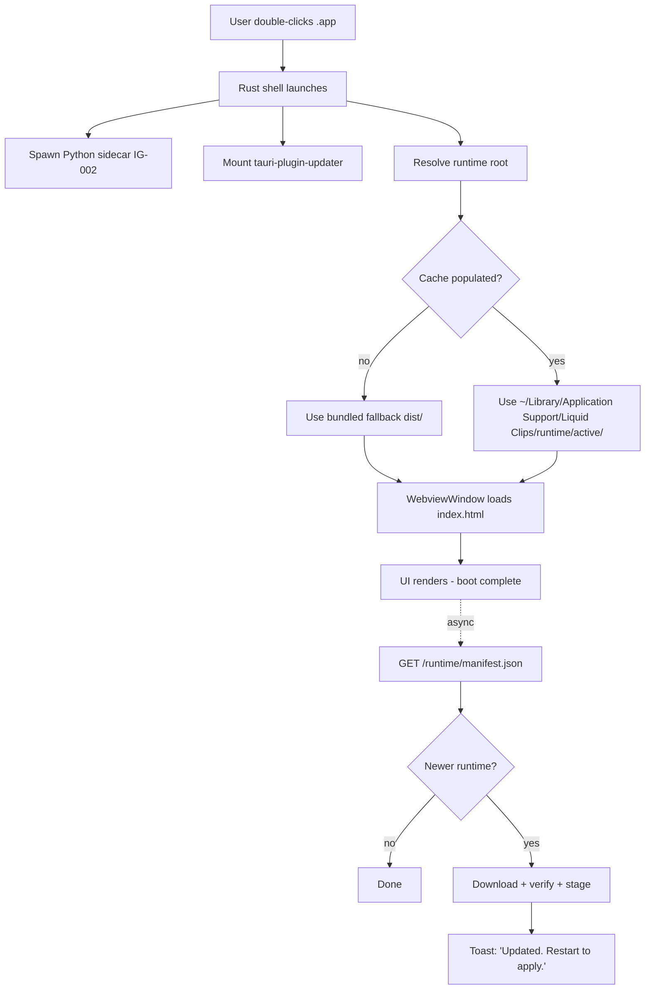
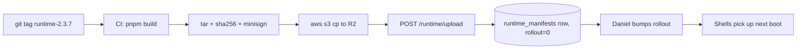

# Runtime Update Architecture · Liquid Clips desktop-2

**Status:** design doc · pre-implementation
**Owner:** desktop-2 shell + junior-backend
**Last updated:** 2026-06-25

---

## TL;DR

The Liquid Clips executable becomes a **thin native shell** that boots
a **hosted runtime bundle** (the React/Vite `dist/` tree) fetched from
our infrastructure. Frontend changes ship as runtime updates; the user
sees *"Liquid Clips has been updated."* No reinstall, no DMG, no
notarisation round-trip.

Native rebuilds are reserved for: Rust in `src-tauri/`, Tauri
permissions in `capabilities/*.json`, sidecar protocol shape, native
OS integrations (deep-link, keychain, fs scopes), the auto-updater
itself, and CSP / security capabilities. Everything else — pages,
copy, components, navigation, feature flags, onboarding, dashboards,
browser tab — is runtime.

Two updaters coexist:
- **Native shell:** `tauri-plugin-updater` against
  `updates.liquidclips.app/latest.json` (rare, signed DMG/tar.gz).
- **Runtime bundle:** new `api.liquidclips.app/runtime/manifest.json`
  serving a signed `dist.tar.gz` (frequent, automatic).

---

## 1 · Boot flow



1. macOS LaunchServices invokes `Liquid Clips.app/Contents/MacOS/liquid-clips-shell`.
2. Rust `run()` (`src-tauri/src/lib.rs:331`) installs the panic hook,
   registers the deep-link scheme, spawns the Python sidecar (IG-002),
   mounts plugins. **No network in this phase.**
3. The new resolver picks `runtime/active/` if present, else the
   shell's own bundled `dist/` (shipped inside the `.app` via
   `tauri.conf.json` `frontendDist`).
4. `tauri::WebviewWindowBuilder` is built with `WebviewUrl::App`
   pointing at the resolved root's `index.html` — the one Tauri 2 hook
   that lets us redirect away from bundled `dist/` without a rebuild.
5. UI renders. Cold-boot budget: **< 2s on M-series, < 3s on Intel.**
   The manifest check does NOT block this path.
6. Async check fires 1–2s after first paint, stages result for **next**
   boot. Never replace the currently-mounted runtime.

**Fresh install:** the `.app` ships a baseline `dist/` in
`Resources/`. First launch finds no `active/`, uses the baseline; the
background check stages the latest for boot #2. Users never see a
blocking "downloading…" screen on first launch.

---

## 2 · Cache strategy

```
~/Library/Application Support/Liquid Clips/
  runtime/
    active           -> ./bundles/2.3.7         (symlink)
    previous         -> ./bundles/2.3.6         (symlink)
    bundles/2.3.7/   (extracted dist/ + manifest.local.json)
    bundles/2.3.6/
    staged/2.3.8.tar.gz
    cache.log
```

| OS | Path |
|---|---|
| macOS | `~/Library/Application Support/Liquid Clips/runtime/` |
| Windows | `%APPDATA%\Liquid Clips\runtime\` |
| Linux | `$XDG_DATA_HOME/liquid-clips/runtime/` |

These map to Tauri's `app_data_dir()` / `BaseDirectory::AppData`, so
the existing `fs:allow-appdata-write-recursive` capability covers
us — no new permission needed.

**Retention:** keep `active` + `previous`. Evict older bundles on the
next successful boot. Staged downloads > 72h old GC'd at boot.

**Disk usage:** today's `dist/` is **220MB unpacked** (mostly brand
`.mp4` placeholders that should be moved out of the runtime). After
moving brand assets behind the `asset:` protocol (CSP already
permits), runtime shrinks to **40–70MB unpacked / 12–20MB gzip-tar'd**.
Worst case rolling 2 = **~140MB** on disk. Acceptable for a
video-tooling app whose project files are gigabytes.

**Invalidation:** a boot that completes without a JS-side
`runtime:fatal` ping within 10s marks the active bundle known-good
(`active.json`). The previous bundle is only promoted to `previous`
**after** the new one is marked good.

---

## 3 · Rollback strategy

| Trigger | Detection | Action |
|---|---|---|
| Manifest signature invalid | shell, pre-download | discard, stay on active |
| Bundle sha256 mismatch | shell, post-download | discard |
| Boot crash (Rust panic) | second cold boot | swap to `previous` |
| Webview never fires `runtime:ready` in 15s | watchdog | swap to `previous` |
| User opens Settings → "Revert last update" | UI | swap, restart |
| Backend force-rollback header | shell, opportunistic | swap |

**Speed:** crash rollback is detected on the NEXT cold boot. We do
not try to revive a frozen webview in-process — the shell exits, the
watchdog flips symlinks before re-creating the webview. Cost to user:
one extra app-launch cycle (~3s).

**Tracking** — `active.json`:

```json
{
  "version": "2.3.7", "sha256": "9f4c...", "channel": "stable",
  "marked_good_at": "2026-06-25T10:14:00Z",
  "boots_observed": 12, "previous_version": "2.3.6"
}
```

A sister `crash.log` records every Rust panic + last 50 lines of
sidecar stderr — used by the watchdog to decide "two crashes in a row
on this runtime = roll back."

**UX:** silent rollback shows a one-line banner first time:
*"We rolled back after a startup issue. We're already looking at the
logs."* + "Send diagnostic." Voluntary rollback hides under Settings →
About → "Use previous runtime (2.3.6)", debug-menu-only until v0.7.x
stabilises.

---

## 4 · Signed manifests

```jsonc
{
  "runtime_version": "2.3.7",
  "channel": "stable",
  "bundle_url": "https://cdn.liquidclips.app/runtime/2.3.7/dist.tar.gz",
  "bundle_size": 18432912,
  "sha256": "9f4c8b...",
  "minisign_signature": "untrusted...",
  "min_shell_version": "2.2.0",
  "max_shell_version": null,
  "released_at": "2026-06-25T09:00:00Z",
  "deprecated_at": null,
  "force_update": false,
  "rollout_percent": 100,
  "notes": "..."
}
```

**Key custody:** reuse the existing minisign keypair already wired for
`tauri-plugin-updater`. Public key is pinned at `tauri.conf.json:80`;
private key lives only on Daniel's signing workstation
(`~/.tauri/liquidclips.key`) and as `MINISIGN_PRIVATE_KEY` in the
GitHub Actions secret store. **Backend has no signing power** — Railway
only stores + serves the already-signed artefacts. A compromised
Railway instance cannot ship a malicious runtime.

**Verification chain:**

```
1. Fetch manifest.json
2. Verify manifest.minisign_signature against pinned pubkey
3. If sig OK + version newer + min_shell satisfied:
4.   Fetch bundle_url
5.   Compute sha256 of bytes; compare to manifest.sha256
6.   Verify bundle's own .sig (defence in depth)
7.   Extract to runtime/staged/<v>/
8.   Atomic rename to runtime/bundles/<v>/
9.   On NEXT boot: re-verify sha256, flip symlinks
```

**Rotation:** generate new minisign keypair offline → sign a "rotation
manifest" with BOTH old + new keys → ship a shell version (one of the
six allowed native rebuilds) that pins both pubkeys → once >95% of
installs run the dual-pubkey shell, switch backend signing to the new
key → next shell rebuild drops the old. A leak demands a native shell
rebuild + DMG ship cycle; Daniel keeps a "rotation drill" runbook.

---

## 5 · Version pinning

| Mechanism | Audience | Implementation |
|---|---|---|
| `LIQUID_CLIPS_RUNTIME_CHANNEL=beta` env var | Daniel + employees | Resolver reads at boot |
| Settings → Debug → Channel picker | Power users | Persists in `active.json.channel` |
| `liquidclips://runtime/pin?version=2.3.5` deep link | Support | Pin + restart |
| `--runtime-dir /path` CLI flag | Dev / QA | Bypass entire fetch |

**Channels:**

```
dev      → built every PR merge
canary   → first 1% of installs
beta     → 10% rollouts
stable   → 100% default
```

Each channel has its own pubkey allowlist server-side — a dev key can
never sign a stable manifest.

**Rollout phasing** — `rollout_percent` gates clients deterministically
via `hash(install_id) % 100 < rollout_percent`. Typical stable: T+0h
`rollout: 1`, T+4h `10`, T+24h `50`, T+72h `100`. No code change per
phase — one `UPDATE` on the manifest row.

---

## 6 · Offline behaviour

Boot proceeds normally against `active/` (or bundled `dist/`). The
async check fails silently on first error and logs the attempt.
`last_successful_check_at` lives in `cache.log`.

| Days since last check | Behaviour |
|---|---|
| 0–7 | Silent. Retry every boot + every 6h. |
| 8–30 | Settings → About shows "Last updated: N days ago". No nag. |
| 31–60 | One-time toast: *"We haven't been able to update Liquid Clips in a month."* |
| 61+ | Toast on every launch + soft red badge on About. No hard block — video work still ships. |

We never block on update freshness. A video editor with no internet
needs to keep editing. Settings → About surfaces runtime version,
shell version, last check, last swap.

---

## 7 · Failed update recovery

**Download fails mid-stream:** resumable via HTTP `Range` headers (R2,
B2, and recent Vercel Blob honour them). Retry 3× with exponential
backoff (4s, 16s, 64s), then defer to next boot. Partial files are
sha256'd before extraction; corrupt partial → drop, restart from byte
0.

**Verify fails:** discard the tarball, increment `bad_manifest_count`
for that `runtime_version` in `cache.log`. After 3 verify failures for
the same version, stop re-attempting until a newer manifest appears.
Send `telemetry/runtime_verify_failed`.

**White-screen / JS crash after swap:** the shell exposes a
`runtime:ready` IPC event the React root emits on first
`useEffect`. The shell starts a 15s watchdog every boot. Timeout →
mark the bundle `bad`, swap `previous` → `active`, exit. Two `bad`
marks permanently quarantine the version (`bundles/2.3.7/QUARANTINED`).

**Telemetry** POSTs to `api.liquidclips.app/telemetry/runtime`
(extending `app/routes/telemetry.py`):

```json
{ "install_id": "...", "shell_version": "2.2.0",
  "runtime_version": "2.3.7", "channel": "stable",
  "event": "verify_failed|watchdog_timeout|swap_success|rollback",
  "detail": {...}, "ts": "..." }
```

PostHog mirrors for cohort tracking.

---

## 8 · Asset CDN

**Recommendation: Cloudflare R2 + Cloudflare CDN.**

| Vendor | Storage | Egress | Notes |
|---|---|---|---|
| Cloudflare R2 | $0.015/GB | **$0** | Best fit. S3-compatible. |
| Backblaze B2 | $0.006/GB | $0.01/GB (free via CF alliance) | Cheapest storage, more setup. |
| Vercel Blob | bundled | counts against Vercel bandwidth | Easiest but scales poorly. |
| Direct Railway | "free" | metered + slow | Fine for the JSON manifest only. |

**Bandwidth model:** ~18MB gzipped tarball × ~4 updates/user/month =
~72MB/user/month.

| Installs | Monthly egress | R2 cost | Vercel Blob est. |
|---|---|---|---|
| 1,000 | 70GB | $0 | ~$10 |
| 10,000 | 700GB | $0 | ~$100 |
| 100,000 | 7TB | $0 | ~$1,000 |

R2's zero-egress pricing makes distribution effectively free. Storage
cost is negligible (≤$1/mo for a year of historical bundles).

R2 + Cloudflare CDN gives PoPs in US, EU, AU, JP, SA, ZA out of the
box. P95 download latency for 18MB ≤ 2s globally. No multi-region
config needed.

**Cache headers:**

```
# bundle (content-addressed → safe)
Cache-Control: public, max-age=31536000, immutable
ETag: "sha256-9f4c8b..."

# manifest (rollout-percent must stay responsive)
Cache-Control: public, max-age=60, must-revalidate
ETag: "v2.3.7-stable"
```

60s manifest TTL keeps rollout bumps responsive without hammering
Railway.

---

## 9 · Railway integration

Extend `junior-backend/app/routes/updates.py` (the file already serving
`tauri-plugin-updater`) with:

```
GET  /runtime/manifest.json?channel=stable&shell_version=2.2.0
POST /runtime/upload                 (CI publish, x-internal-secret gated)
```

Reads from a new Postgres table:

```sql
CREATE TABLE runtime_manifests (
  channel         TEXT NOT NULL,
  runtime_version TEXT NOT NULL,
  bundle_url      TEXT NOT NULL,
  sha256          TEXT NOT NULL,
  signature       TEXT NOT NULL,
  min_shell       TEXT NOT NULL,
  max_shell       TEXT,
  rollout_percent SMALLINT NOT NULL DEFAULT 0,
  released_at     TIMESTAMPTZ NOT NULL,
  deprecated_at   TIMESTAMPTZ,
  notes           TEXT,
  PRIMARY KEY (channel, runtime_version)
);
```

`GET /runtime/manifest.json` returns the highest-version row for the
channel where `rollout_percent >= hash(install_id) % 100` AND
`min_shell <= shell_version <= COALESCE(max_shell, shell_version)`.

**Bundles live on R2**, not Railway. CI runs `pnpm build`, tars
`dist/`, signs with minisign, pushes to
`s3://liquidclips-runtime/<channel>/<version>/dist.tar.gz`, then POSTs
`/runtime/upload` with metadata. Railway inserts a row with
`rollout_percent: 0`; Daniel bumps via an admin endpoint (same pattern
as the existing campaign admin in `account-app`).

**New env vars:** `R2_ACCOUNT_ID`, `R2_ACCESS_KEY_ID`,
`R2_SECRET_ACCESS_KEY` (CI only), `RUNTIME_CDN_BASE`
(e.g. `cdn.liquidclips.app`). `INTERNAL_API_SECRET` already exists.



---

## 10 · Security model

| Threat | Mitigation |
|---|---|
| Manifest endpoint swapped (DNS hijack) | HTTPS-only + signed JSON + Rust-hardcoded hostname (requires rebuild to change) |
| Signing key leaked | Dual-key rotation (§4); `emergency_force_min_shell` env var forces all installs onto a new shell, old shells refuse the manifest and bail to bundled `dist/` |
| Malicious JS inside signed bundle (insider/supply chain) | CSP allowlist in `tauri.conf.json:27` blocks arbitrary exfil; `script-src 'self' 'wasm-unsafe-eval'` blocks inline/eval; Tauri command allowlist (`capabilities/default.json`) hard-caps what JS can invoke |
| User's local files | Tauri capability gate + CSP |
| User's keychain JWT | `keyring` access mediated by Rust command (not JS) |
| CDN tampering | sha256 + minisign double-check |
| Forced downgrade | Versions monotonic; shell refuses `runtime_version < active.version` unless manifest sets `force_rollback` |

**Not adopting cert pinning** — Tauri 2 lacks first-class support and
rotating pinned certs is brittle for a solo team. Signature
verification is the load-bearing defence. Daniel is the only commit
author on `desktop-2/`; CI build attestation (GitHub `id-token`) gets
recorded in `runtime_manifests` for forensics.

---

## 11 · Update frequency

- **Check every cold boot** (1s after `runtime:ready`).
- **In-session: every 6h** while the app is open — long editor
  sessions are common.
- **Backoff on failure:** 4s, 16s, 64s, 5min, 30min, 6h (PostHog
  ladder).

**Default:** new runtime stages silently, applies on NEXT cold boot.
Title-bar "Restart to update" badge (Slack idiom) appears after
`deprecated_at` is crossed for the current version.

**`force_update: true`:** in-session modal *"Liquid Clips needs to
restart to apply a critical update."* with "Restart now" + 30s
deferral. Reserved for security patches.

**`min_shell_version` violation:** runtime check refuses the bundle,
falls back to bundled `dist/`, banner reads *"A newer version of
Liquid Clips is available — install from the download page."* —
hand-off to `tauri-plugin-updater`.

We never hot-swap a runtime in a running session. Mid-session swaps
mean unmounting React, losing in-flight state, and breaking the
sidecar's view of clip projects. The "Liquid Clips has been updated"
moment is **on next launch**, with the swap completed pre-webview.

---

## 12 · Compatibility with existing auto-updater

| Updater | Scope | Cadence | Trigger |
|---|---|---|---|
| `tauri-plugin-updater` (existing) | Native `.app` / `.dmg` | Rare (sidecar protocol, capabilities) | Manual approval, full installer |
| Runtime updater (this doc) | Frontend `dist/` only | Frequent (weekly+) | Automatic on boot |

Tauri 2's `WebviewWindowBuilder` accepts `WebviewUrl::App` pointing at
any directory the shell can read. `frontendDist` in
`tauri.conf.json:10` defines the **fallback** baseline shipped inside
the `.app`. At runtime, we override:

```rust
let runtime_root = resolve_runtime_root(&app_handle)?;
let index = runtime_root.join("index.html");
tauri::WebviewWindowBuilder::new(
    &app_handle, "main",
    tauri::WebviewUrl::App(index.into()),
).build()?;
```

Tauri's asset protocol still resolves because the runtime root lives
inside the AppData scope already declared in `tauri.conf.json:29-34`
and `capabilities/default.json`.

**`min_shell_version` is the hand-off.** When a frontend change needs
a new Tauri command or capability, the manifest declares
`min_shell_version: "2.3.0"`. Shells on `2.2.x` skip the runtime;
user sees: *"This update needs a newer Liquid Clips. Restart to
install the latest version."* Click triggers
`tauri-plugin-updater::check()` — the native updater. Most weeks,
frontend ships alone. Monthly, shell + runtime release ship together:
shell first, runtime that depends on its new commands second.

---

## Open questions

1. **CDN vendor lock-in.** R2 is recommended, but Daniel may prefer
   Vercel Blob to avoid managing a new vendor. Under 10k installs,
   Vercel Blob is fine (~$100/mo is rounding error vs the time cost of
   an R2 migration later). **Decision needed before phase 1 ships.**

2. **Channel granularity.** Do we want `clipper-beta` and `agency-beta`
   splits? Adds complexity to rollout-percent logic. Recommended
   default: no — one channel ladder per shell version, tier-gating
   happens inside the JS bundle.

3. **`active.json` storage backend.** Flat JSON is fine for one user
   per install. Multi-user installs (kiosk, corporate IT push) would
   want sqlite. **Defer** — no real demand today.

---

## RECOMMENDED PHASE 1 SCOPE

The minimum viable cut that proves the architecture works. Ship behind
`LIQUID_CLIPS_RUNTIME_ENABLED=1` so it's opt-in for Daniel + employees
until the swap survives a real-world week.

**In scope:**

1. **Backend:** `GET /runtime/manifest.json` in
   `junior-backend/app/routes/updates.py`. Read from a single
   `runtime_manifests` row (stable only, no rollout-percent yet).
2. **Backend:** `POST /runtime/upload` accepting tarball + signature
   + metadata, gated by `INTERNAL_API_SECRET`. Mirror existing
   `/updates/upload`.
3. **CDN:** R2 bucket `liquidclips-runtime` provisioned; CI gets
   credentials; manual `aws s3 cp` for the first ship.
4. **Shell (Rust):** `resolve_runtime_root()` preferring
   `~/Library/Application Support/Liquid Clips/runtime/active/`,
   falling back to bundled `dist/`. `WebviewWindowBuilder` wired to
   that path. Background `tokio::spawn` after boot that GETs the
   manifest, verifies the signature against the pinned pubkey,
   downloads the tarball, verifies sha256, extracts to
   `runtime/staged/<v>/`, atomic-renames to `runtime/bundles/<v>/`,
   updates `next_boot.json`.
5. **Boot resolver** reads `next_boot.json` and flips the `active`
   symlink BEFORE constructing the webview.
6. **CI script** tars `dist/`, computes sha256, signs with the
   existing minisign key, uploads to R2, POSTs to `/runtime/upload`.

**Explicitly NOT in phase 1:** rollback (manual `rm -rf` for now),
watchdog / `runtime:ready` event, channel/rollout-percent, Windows +
Linux (phase 2), admin UI for rollouts (POST + psql one-liner is
fine), in-session 6h re-check (boot-time only), force-update modal,
telemetry beyond a single `runtime_swap` PostHog event.

**Done definition.** Daniel can:

```bash
cd desktop-2
# edit src/Home.tsx — change a heading
pnpm build
./scripts/runtime-ship.sh stable 2.3.1
# wait 30s, quit + relaunch Liquid Clips
# see the new heading, no DMG install
```

…and Settings → About → Runtime reads `2.3.1`. That's the proof the
architecture works. Everything else in this doc is the hardening pass
that follows.
