# Liquid Clips end-to-end system scope

> Created 2026-05-28.
> Purpose: one source of truth for what "end to end" means before creators promote Liquid Clips and before 0.4.34 ships.

## Decision

Liquid Clips is not ready to be described as "fully done" until the complete reward-clipping money loop is testable.

The current build can demo the core direction, but public promotion should use careful language until the missing loop pieces are complete.

## Product definition

Liquid Clips is the desktop command center for reward clippers.

The system must help a user:

1. Sign in.
2. Browse reward campaigns.
3. Save/understand the campaign brief.
4. Import source assets.
5. Generate a batch of eligible clips.
6. Export organized clips.
7. Post manually.
8. Add post/submission URLs.
9. Track status, views, and payout route.
10. Understand who pays them: Whop, external platform, or Liquid Clips via Stripe Connect.

## Master flow

```mermaid
flowchart LR
  A["Install / update app"] --> B["Sign in with Google or email"]
  B --> C["Activation deep link returns to Liquid Clips"]
  C --> D["Browse rewards in side browser"]
  D --> E["Save campaign brief"]
  E --> F["Import source assets"]
  F --> G["Generate clip batch"]
  G --> H["Review hooks, titles, brief fit"]
  H --> I["Export campaign folder"]
  I --> J["Post manually to socials"]
  J --> K["Add post URL / submit on platform"]
  K --> L["Track status, views, payout"]
  L --> M["Make variants of winners"]
  M --> H
```

## Phase gates

| Phase | Gate | Status rule |
|---|---|---|
| Phase 0 | Installed app reliability | Must show correct version, quit cleanly, no stale sidecar, launch from `/Applications`. |
| Phase 1 | Auth and activation | Browser auth returns to app with `liquidclips://activate`; user unlocks without App Store/error. |
| Phase 2 | Browse Rewards workbench | Right-side browser is full-height, scrolls independently, URL bar works, Open Brief stays in app. |
| Phase 3 | Campaign brief v1 | User can save campaign URL/rules/payout/platforms/source link manually. |
| Phase 4 | Asset import/export | User can import local source and Google Drive assets, then export organized campaign clips. |
| Phase 5 | Submission tracking | User can add post URL, mark status, record views, estimate payout. |
| Phase 6 | Payout onboarding | User can distinguish Whop reward payouts vs Liquid Clips affiliate Stripe Connect payouts. Stripe setup is visible and completeable. |
| Phase 7 | Creator-demo readiness | A YouTube creator can show the workflow honestly without claiming unsupported automation. |
| Phase 8 | Production release | Signed/notarized build, manifest updated, updater verified, Apple-side requirements cleared. |

## Current truth

| Capability | Current state | Required before creator promo |
|---|---|---|
| Installed 0.4.34 version verification | In progress / local-install working | Must pass every build. |
| Sign in and activation | Passed once, must retest after v2 build | Required. |
| Browse Rewards side browser | Working, v2 scroll/resize fixes building | Required. |
| Campaign brief save | Scoped, not built | Required for "complete workflow" claim. |
| Clip generation/export | Existing, needs smoke test in 0.4.34 | Required. |
| Google Drive import | Not yet fully scoped in UI | Required if demos use campaign asset folders. |
| Google Drive export/upload | Not yet built/scoped in UI | Nice for demos; required if claiming Drive workflow. |
| Submission tracker | Scoped, not built | Required for "track submissions/payouts" claim. |
| Stripe Connect affiliate onboarding | Backend live; UI needs clearer setup/status | Required for affiliates, not Whop reward payouts. |
| Smooth updater | Wired, gaps documented | Required before wide customer rollout. |

## Google Drive scope

Google Drive matters because campaign platforms often provide source assets through Drive folders.

### Google Drive import

Required v1:

| Requirement | Notes |
|---|---|
| Paste Google Drive file/folder URL | User can paste campaign source folder/file. |
| Open in browser fallback | If direct import is not ready, app opens Drive link and user downloads manually. |
| Download selected asset | App should support downloading video assets from an authorized Drive link when possible. |
| Attach asset to campaign brief | The source asset URL belongs to the active campaign. |
| Local cache path | Save to `~/Liquid Clips/rewards/<campaign>/source/`. |

### Google Drive export/upload

Required v1:

| Requirement | Notes |
|---|---|
| Export campaign folder locally | `~/Liquid Clips/rewards/<campaign>/<date>/exports/`. |
| Optional upload to Drive | User selects a connected Drive folder and uploads exported clips. |
| Copy Drive share link | Useful for client/creator review or campaign submission if needed. |
| No forced cloud upload | Local-first remains default. |

### Implementation stance

Do not block 0.4.34 on full Google Drive automation unless source import is required for the demo. Minimum acceptable demo behavior is:

1. Paste campaign Drive link into brief.
2. Open/download manually.
3. Import local video.
4. Export clips to organized campaign folder.

Then build Drive API upload/import as P1.

## Payout scope

| Money route | Who pays | UI message |
|---|---|---|
| Whop Content Rewards | Whop / campaign owner via Whop | "Reward payouts are handled by Whop. Submit and manage payout status on Whop." |
| Clipify/external campaigns | External campaign platform | "This campaign is paid by the platform running it." |
| Liquid Clips affiliate program | Liquid Clips via Stripe Connect | "Set up Stripe Connect to receive Liquid Clips affiliate commissions." |
| Liquid Clips subscription billing | Customer pays Liquid Clips | Managed through account billing; not the same as reward payouts. |

Stripe Connect onboarding is complete only when the app/account dashboard shows:

- Not started
- Onboarding required
- Pending verification
- Restricted
- Ready / active
- Open Express Dashboard

## Creator-demo rules

A creator can safely say:

- "Liquid Clips lets you browse rewards inside the app."
- "You can keep the campaign open while clipping."
- "The app is being built around campaign briefs, batches, exports, and submission tracking."
- "This is an early workflow demo."

A creator should not say yet:

- "It fully automates Whop payouts."
- "It guarantees approval."
- "It posts everything for you."
- "It tracks every platform view automatically."
- "It replaces Whop/Clipify."

## Definition of end-to-end done

End to end is done when this exact checklist passes:

1. Install/reopen shows the latest version.
2. Sign in works.
3. Browse Rewards works.
4. A campaign brief can be saved.
5. Source video can be imported from local file or Drive-assisted flow.
6. Clips can be generated and exported into a campaign folder.
7. User can add post URL/submission status.
8. Payout route is clear.
9. Stripe Connect affiliate onboarding status is visible where relevant.
10. Quit/reopen preserves state and does not leave sidecar processes behind.

Until then, demos are allowed, but public copy must frame the product as an active build, not a finished automation machine.
